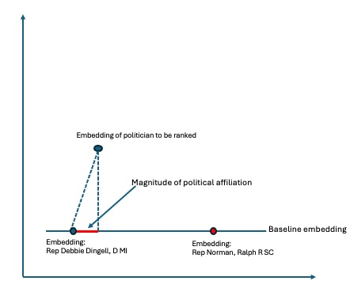

# **Political Analysis: Inferring Ideological Alignment from Rhetoric**

This project investigates the relationship between politicians' **public statements** and their **political ideology** using **natural language processing (NLP)** techniques. The primary objective is to determine how well a politician’s rhetoric aligns with their ideological stance.

## **Project Overview**
The project is structured into two main tasks:

### **1. Extracting Opinion Statements**  
- Public statements were scraped from the **VoteSmart API**, including speeches, interviews, and social media posts.
- A **fine-tuned DistilBERT model** classified sentences as **subjective (opinion-based)** or **objective (fact-based)**.
- Only **subjective statements** were retained for ideological ranking.

### **2. Ranking Politicians by Ideology**  
- The ideological ranking was derived from **sentence embeddings**.
- Each politician’s subjective statements were converted into **vector embeddings**.
- These embeddings were projected onto a **reference ideological axis**, defined by politicians with known ideological leanings (from the **Limited Government Scorecard**).
- The ranking was compared to expert-driven evaluations to assess accuracy.

## **Methodology**
- **Text Classification**: A **fine-tuned DistilBERT model** was used to separate **opinion-based** from **factual** statements.
- **Feature Extraction**: Sentence embeddings were generated from opinion statements.
- **Ranking Approach**: Politicians’ embeddings were **projected onto an ideological spectrum** using reference embeddings. Below is a simple graphic that captures the approach.
    - 
- **Validation**: The model’s rankings were compared to an **expert-curated** ideological ranking (from the **Limited Government Scorecard**).

## **Results**
The **DistilBERT model** outperformed the variations of Naive Bayes and achieved an accuracy of **75.8%** in detecting subjective sentences.

#### **Ideology Project Model Results:**
```yaml
Spearman_Correlation: 0.607 
Kendall_Tau: 0.403 
MAE_Rank: 9.15  
RMSE_Rank: 11.02  
Percent_Perfect_Matches: 4.88%
```
## Ideology Project Model Results

The **embedding-based ranking approach** captures ideological alignment **moderately well**, based on these results. The **Spearman correlation (0.607)** suggests a meaningful, though imperfect, relationship between the predicted rankings and the expert-curated ideological rankings. This indicates that while the model identifies ideological trends, there is still room for improvement in refining its predictions.

### Strengths & Areas for Improvement

This methodology **remains promising**, particularly due to its **flexibility and adaptability**—allowing different **base ideological reference points** to be used across various political spectrums. However, **further refinements** are necessary to improve accuracy, particularly for politicians with **limited or less ideologically distinct speech data**.

Future improvements could focus on:
- **Enhancing feature representation** by incorporating additional linguistic and contextual information.
- **Refining ranking methods** to better handle politicians with **limited speech data**.
- **Exploring alternative distance metrics** or **ensemble approaches** to improve ranking robustness.

Overall, while this approach provides a **useful framework for political analysis**, further tuning and additional data considerations will help improve its **predictive accuracy and reliability** across a wider range of politicians.

## Project Organization

```
├── LICENSE            <- MIT Open Source license
├── app                <- Dash app for interactive display of politician ranking
│   └── app.py                 <- Dash app, run to get interactive display
│   └── rank_idology.py        <- Takes politician names as arguments to rank them along political ideology axis
│   └── mean_embeddings_df.pkl  <- Copy of feature embeddings created by running 'python main.py extract_features' (requires commands leading up to that to be run as well)
│
├── Makefile           <- Makefile with convenience commands to set up environment 
├── README.md          <- The top-level README for developers using this project.
├── data
│   ├── opinion_extraction
│    │   ├── external       <- Data from external sources, including training corpus (newssd) and subjectivity lexicon (MPQA)
│    │   ├── processed      <- The final, canonical data sets for modeling as well as their associated vectorizers for later predictions
│    │   ├── raw            <- Scraped corpus of politician's public statements
│   ├── political_ideology_ranking
│    │   ├── features       <- Final reference embeddings used as features for modeling political ideology
│    │   ├── interim        <- Intermediate data that has been transformed -- contains sentences extracted from opinion_extraction -> raw
│    │   ├── processed      <- The final, canonical data sets for modeling -- filtered sentences from interim folder
│    │   ├── raw            <- The original, scraped data of politician's public statements
│
├── docs               <- Project report and presentation (manually written) . . . Note that these were written early on and this project 
│                         as elvolved further.  Presentation is worthwhile to review to understand project intent 
│
├── models             <- Trained and serialized models / scripts (in the case of ranking political ideology) 
│   ├── opinion_extraction            <- Trained and serialized models to extract opinions (Baysian Models with various features + 
│                                         Fine Tuned BERT Mode)
│   ├── political_analysis            <- Script for selecting base case politicians and ranking them along that political spectrum 
│
├── notebooks          <- Jupyter notebooks.
│
├── references         <- Data dictionaries, manuals, and all other explanatory materials.
│
├── outputs            <- Model training results and Figures used in write-up
│   └── figures        <- Generated graphics and figures to be used in reporting
│
├── requirements.yml   <- The requirements file for reproducing the analysis environment, e.g.
│                         generated with `make create_environment' with the terminal in the main environment
│
├── setup.cfg          <- Configuration file for flake8
│
└── src   <- Source code for use in this project.
│   └── opinion_extraction     <- Code for extracting, processing, and analyzing opinion data.
│   │   ├── bert_processor.py       <- Prepares datasets for BERT-based classification.
│   │   ├── BERTTrainer.py          <- Trains and evaluates a DistilBERT model for text classification.
│   │   ├── dataset_processor.py    <- Processes training, validation, and test datasets and saves them in processed data folders
│   │   ├── data_loader.py          <- Loads various dataset formats (TF-IDF, BERT, raw text).
│   │   ├── data_plotter.py         <- Generates visualizations for opinion classification task (sentence distributions, word clouds...) 
│   │   ├── mpqa_processor.py       <- Extracts features from the MPQA subjectivity lexicon.
│   │   ├── NBTrainer.py            <- Trains and evaluates Naive Bayes models for text classification.
│   │   ├── text_processing_helpers.py <- Tokenization and NLP preprocessing helper functions using SpaCy (needed for vectorizers)
│   │   ├── tfidf_processor.py      <- Generates TF-IDF feature matrices and vectorizers from datasets.
│   │
│   ├── ideological_ranking    <- Code for ranking politicians based on their public statements
│   │   ├── preprocess_raw_opinions.py    <- Prepares datasets for BERT-based classification.
│   │   ├── extract_features.py           <- Uses averaged sentence level embeddding to generate average politican sentence embedding
│   │   ├── evaluate_ranking.py           <- Compares generated ranking to Legislative Analysis Ranking to get error / correlation scores
│
├── config.py               <- Store useful variables and configuration
│
├── main.py                 <- Typer commands to run part or all of the data training pipeline.  

```

--------

